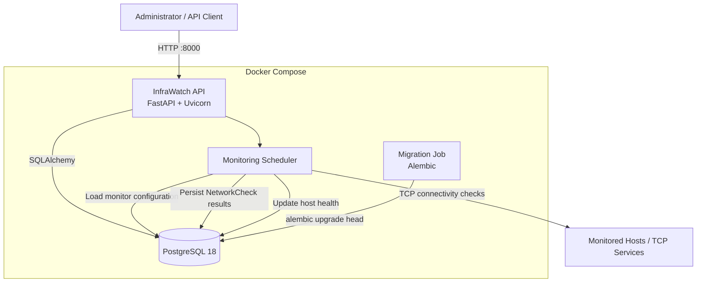
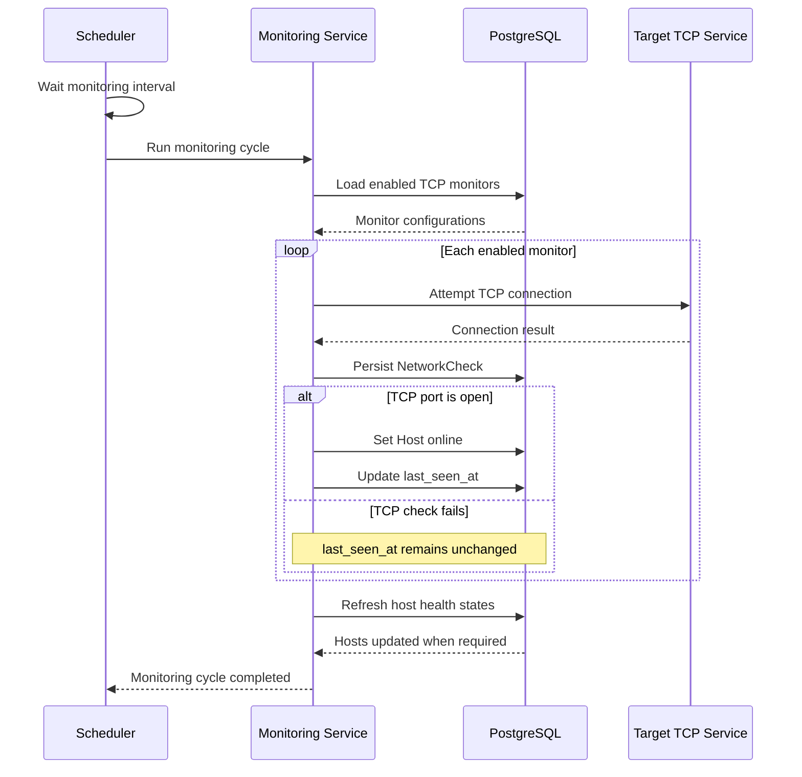

# InfraWatch

InfraWatch is a portfolio project for infrastructure monitoring, network service availability, and host health management across small Windows and Linux environments.

The project is designed to demonstrate practical skills in backend development, system administration, networking, PostgreSQL, Docker, monitoring, automated testing, and infrastructure-oriented software design.

## Current Status

InfraWatch currently provides a working backend monitoring platform with automated TCP monitoring and containerized deployment.

### Implemented

- FastAPI REST API
- Windows/Linux host inventory
- PostgreSQL persistence
- Host CRUD operations
- TCP connectivity checks
- Persistent network check history
- Network check filtering
- Configurable TCP monitors
- Automated periodic monitoring
- Host `online`, `offline`, and `unknown` health states
- Configurable host offline threshold
- Automatic host health refresh
- Resilient monitoring cycles
- Scheduler lifecycle integrated with FastAPI
- Operational scheduler logging
- Alembic database migrations
- Automatic migrations before API startup
- Dockerized API
- Dockerized PostgreSQL
- Docker Compose deployment
- Container health checks
- Non-root API container
- Automated testing with pytest
- Static code quality checks with Ruff

## Architecture



### Container Startup Flow

```text
PostgreSQL starts
        |
        v
PostgreSQL healthcheck
        |
        | healthy
        v
Alembic migration container
        |
        | alembic upgrade head
        |
        | exit code 0
        v
InfraWatch API starts
        |
        v
Monitoring scheduler starts
        |
        v
API healthcheck
```

The API is started only after PostgreSQL is healthy and all database migrations have completed successfully.

## Monitoring Workflow



A failed TCP check does **not** immediately mark a host as offline.

InfraWatch separates service availability from host health:

```text
Successful TCP observation
        |
        v
Host status = online
last_seen_at = current time


Failed TCP observation
        |
        v
NetworkCheck is persisted
last_seen_at is unchanged
        |
        v
Health policy evaluates elapsed time
        |
        +-- within threshold --> online
        |
        +-- beyond threshold --> offline
```

This prevents a single temporary service failure from immediately being interpreted as complete host failure.

## Data Model

InfraWatch separates monitoring configuration from monitoring history.

```text
Host
 |
 +---- TcpMonitor
 |       |
 |       +-- defines WHAT should be checked
 |
 +---- NetworkCheck
         |
         +-- records WHAT actually happened
```

### Host

Represents a monitored machine.

Important fields include:

- hostname
- IP address
- operating system
- status
- last successful observation time

### TcpMonitor

Represents a TCP monitoring configuration.

Examples:

```text
Host: SERVER01
Port: 22
Timeout: 1 second
Enabled: true
```

A host can have multiple TCP monitors.

### NetworkCheck

Represents the historical result of an executed TCP check.

Stored information includes:

- host
- TCP port
- open/closed result
- duration
- error information
- timestamp

This separation makes it possible to retain monitoring history without mixing historical telemetry with monitor configuration.

## Technology Stack

### Backend

- Python 3.13
- FastAPI
- Uvicorn
- Pydantic
- Pydantic Settings

### Database

- PostgreSQL 18
- SQLAlchemy 2
- Psycopg 3
- Alembic

### Infrastructure

- Docker
- Docker Compose
- Docker health checks

### Quality and Testing

- pytest
- Ruff

## Docker Networking

During local development from Windows, PostgreSQL is exposed as:

```text
127.0.0.1:5433
```

The mapping is:

```text
Windows host
    |
    | localhost:5433
    v
PostgreSQL container:5432
```

Containers communicate differently.

The InfraWatch API connects directly through the Docker Compose network:

```text
infrawatch-api
      |
      | postgres:5432
      v
infrawatch-postgres
```

Therefore the API container uses:

```text
POSTGRES_HOST=postgres
POSTGRES_PORT=5432
```

instead of the host-side `127.0.0.1:5433` configuration.

## Quick Start

### Requirements

Install:

- Git
- Docker Desktop
- Docker Compose

Clone the repository and enter the project directory.

Create the environment file from the provided example:

```powershell
Copy-Item .env.example .env
```

Edit `.env` and configure a secure PostgreSQL password.

Then start InfraWatch:

```powershell
docker compose up -d --build
```

Check the containers:

```powershell
docker compose ps -a
```

A successful startup should show:

```text
infrawatch-postgres   healthy
infrawatch-migrate    Exited (0)
infrawatch-api        healthy
```

`infrawatch-migrate` exiting with code `0` is expected. It is a one-shot container whose only responsibility is applying database migrations.

Test the API:

```powershell
Invoke-RestMethod http://127.0.0.1:8000/health
```

Expected response:

```text
status  service         version
------  -------         -------
ok      infrawatch-api  0.0.1
```

Interactive FastAPI documentation is available at:

```text
http://127.0.0.1:8000/docs
```

## Configuration

InfraWatch uses environment variables for runtime configuration.

Example:

```text
POSTGRES_DB=infrawatch
POSTGRES_USER=infrawatch
POSTGRES_PASSWORD=change-me
POSTGRES_HOST=127.0.0.1
POSTGRES_PORT=5433

HOST_OFFLINE_AFTER_SECONDS=300
MONITORING_INTERVAL_SECONDS=60
```

### Monitoring Interval

```text
MONITORING_INTERVAL_SECONDS
```

controls how long the scheduler waits between monitoring cycles.

### Offline Threshold

```text
HOST_OFFLINE_AFTER_SECONDS
```

controls how long a host can remain without a successful observation before being classified as offline.

## Database Migrations

InfraWatch uses Alembic to version and manage the PostgreSQL schema.

Current migration flow:

```text
create hosts table
        |
        v
add network_checks table
        |
        v
add host last_seen timestamp
        |
        v
add tcp_monitors table
```

When Docker Compose starts the application, the dedicated migration service automatically runs:

```powershell
python -m alembic upgrade head
```

The API is started only if this command completes successfully.

The migration workflow has also been validated against a completely empty PostgreSQL database, confirming that the entire schema can be recreated from scratch.

## API

InfraWatch exposes REST endpoints for:

- service health
- host creation
- host listing
- host retrieval
- host updates
- host deletion
- individual host health refresh
- batch host health refresh
- manual TCP checks
- network check history
- network check filtering
- TCP monitor creation
- TCP monitor listing
- TCP monitor retrieval
- TCP monitor updates
- TCP monitor deletion

The complete interactive API specification can be explored through FastAPI Swagger documentation:

```text
http://127.0.0.1:8000/docs
```

## Automated Monitoring

InfraWatch contains an internal asynchronous scheduler integrated with the FastAPI application lifecycle.

At application startup:

```text
FastAPI lifespan
      |
      v
asyncio scheduler task
      |
      v
periodic monitoring cycle
```

Blocking monitoring work is executed outside the main asyncio event loop.

Monitoring cycles do not overlap.

If an individual TCP monitor fails unexpectedly:

```text
monitor fails
     |
     +--> database transaction rollback
     |
     +--> error logged
     |
     +--> remaining monitors continue
```

If an entire monitoring cycle fails, the scheduler logs the error and continues trying during later cycles.

## Container Security

The API container does not run the application as root.

The Docker image creates a dedicated user:

```text
appuser
```

and Uvicorn runs using that account.

This follows the principle of least privilege and reduces unnecessary privileges inside the application container.

## Development Setup

Create a virtual environment:

```powershell
py -3.13 -m venv .venv
```

Activate it:

```powershell
Set-ExecutionPolicy -Scope Process -ExecutionPolicy Bypass
.\.venv\Scripts\Activate.ps1
```

Install the project with development dependencies:

```powershell
python -m pip install -e ".[dev]"
```

Run Ruff:

```powershell
ruff check .
```

Run the test suite:

```powershell
python -m pytest -v
```

Validate the database schema against SQLAlchemy models:

```powershell
python -m alembic check
```

## Project Structure

```text
infrawatch/
|
+-- backend/
|   |
|   +-- app/
|   |   |
|   |   +-- api/routes/
|   |   +-- core/
|   |   +-- db/
|   |   +-- models/
|   |   +-- schemas/
|   |   +-- services/
|   |   +-- main.py
|   |
|   +-- tests/
|
+-- migrations/
|   |
|   +-- versions/
|   +-- env.py
|
+-- Dockerfile
+-- compose.yaml
+-- alembic.ini
+-- pyproject.toml
+-- .env.example
+-- .dockerignore
+-- README.md
```

## Design Decisions

### Monitor Configuration vs Monitoring History

`TcpMonitor` and `NetworkCheck` deliberately represent different concepts:

```text
TcpMonitor
    = desired monitoring configuration

NetworkCheck
    = historical monitoring observation
```

This keeps configuration data independent from operational telemetry.

### Service Failure vs Host Failure

A closed or unreachable TCP service does not necessarily mean that the entire host is offline.

InfraWatch therefore uses successful observations and elapsed time to determine host health instead of changing host status immediately after one failed TCP connection.

### Scheduler Scope

The current scheduler is intentionally designed for a single application process.

Running multiple Uvicorn workers would create one scheduler per process and could therefore execute duplicate monitoring cycles.

A future distributed deployment could move monitoring execution into a dedicated worker or introduce distributed coordination.

## Roadmap

Planned development includes:

- CPU, memory, disk, and uptime monitoring
- Windows monitoring agent
- Linux monitoring agent
- historical system metrics
- host and service state transition events
- rule-based alerts
- authentication and authorization
- API security improvements
- audit logging
- web dashboard
- Continuous Integration
- expanded observability
- deployment hardening

## Project Goals

InfraWatch is primarily a portfolio and learning project focused on practical infrastructure engineering.

The project is intended to demonstrate skills in:

- Windows and Linux infrastructure concepts
- TCP/IP networking
- backend API development
- PostgreSQL administration
- relational data modeling
- automated monitoring
- asynchronous task scheduling
- Docker containerization
- container networking
- database migrations
- health checks
- fault tolerance
- automated testing
- software troubleshooting
- secure development practices
